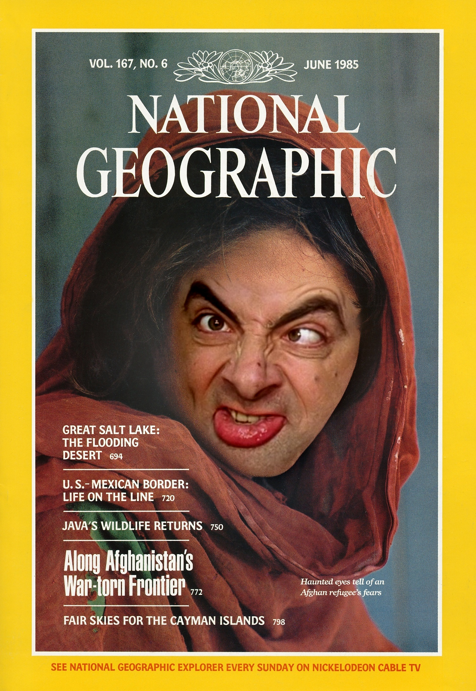
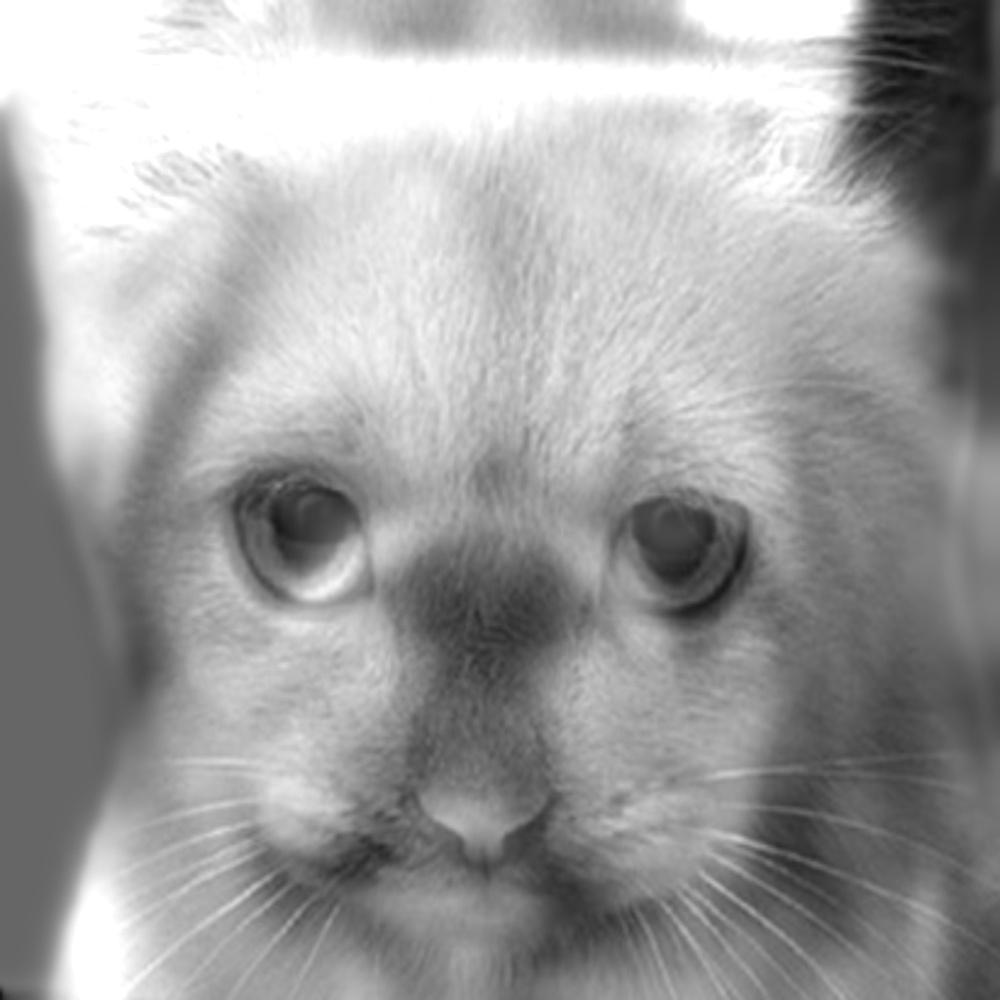

#### PYRAMID BLENDING
| Source Image | Target Image | Blended Result |
|:---:|:---:|:---:|
|  |  |  |

#### HYBRID IMAGES
| Low Freq (Far View) | High Freq (Close View) | Hybrid Result |
|:---:|:---:|:---:|
|  |  |  |

# Pyramid Blending & Hybrid Images Toolkit

A robust computer vision system implementing multi-scale image processing techniques. This project focuses on **Laplacian Pyramid Blending** for seamless image compositing and **Hybrid Images** for frequency-based optical illusions, backed by a complete FFT analysis pipeline.

## 🧠 Algorithmic Core

This toolkit relies on signal processing principles, specifically the manipulation of image frequencies using Gaussian and Laplacian pyramids.

### 1. Laplacian Pyramid Blending

Standard "naive" blending (alpha blending) often results in visible seams or "ghosting" artifacts. To solve this, we blend images at multiple scales simultaneously.

**Gaussian Pyramid Construction:**
We generate a sequence of images where each level is a low-pass filtered (blurred) and downsampled version of the previous one. We use a separable 1D Gaussian kernel ($[1, 4, 6, 4, 1]/16$) for efficient $O(N)$ convolution.

**Laplacian Pyramid (Detail Extraction):**
To isolate specific frequency bands, we construct a Laplacian Pyramid. Each level $L_i$ represents the "detail" lost when downsampling from level $i$ to $i+1$:
$$L_i = G_i - \text{Expand}(G_{i+1})$$

**Multi-Scale Blending:**
Instead of a single blend operation, we blend each frequency band separately using a Gaussian-blurred mask $M$:
$$B_i = L_{source,i} \cdot M_i + L_{target,i} \cdot (1 - M_i)$$
This ensures that low frequencies (colors, lighting) blend over a wide area, while high frequencies (texture, edges) blend over a sharp transition, resulting in a seamless composite.

### 2. Hybrid Images

Hybrid images are static images that change interpretation based on viewing distance. This exploits the human visual system's multiscale processing.

**Frequency Separation:**
* **Low-Pass Filter:** Removes fine details, leaving only broad shapes and colors (visible from a distance).
* **High-Pass Filter:** Removes the low-frequency structure, leaving only edges and fine details (visible only when close).

**Composition:**
The final image $H$ is a linear combination of the two filtered components:
$$H = w_{low} \cdot \text{LowPass}(I_1) + w_{high} \cdot \text{HighPass}(I_2)$$

### 3. FFT Analysis Pipeline

To verify the spectral properties of our operations, the system includes a Fourier Transform analysis module. It visualizes the Log-Magnitude Spectrum ($20 \cdot \log(|FFT|)$) to demonstrate how high frequencies are attenuated or amplified during the blending process.

## 🏗️ Package Structure

The project is refactored into a modular production-grade architecture to ensure separation of concerns between math, logic, and UI.

```text
Pyramid-Toolkit/
├── src/
│   ├── core/
│   │   ├── filters.py      # Separable convolution, Gaussian kernels, Reduce/Expand
│   │   └── pyramids.py     # Gaussian & Laplacian pyramid construction/reconstruction
│   │
│   ├── pipelines/
│   │   ├── blending.py     # Logic for seamless pyramid blending
│   │   └── hybrid.py       # Logic for frequency-based hybrid images
│   │
│   ├── utils/
│   │   ├── ui.py           # Interactive OpenCV tools (Polygon Mask, Affine Warp)
│   │   └── visualization.py # FFT spectrum plots, Pyramid viz, Matplotlib helpers
│
├── main.py                 # CLI Entry Point (argparse)
└── requirements.txt        # Dependencies
```

## 🚀 Installation & Usage

### Prerequisites
- Python 3.8+
- NumPy, OpenCV, Matplotlib

### Installation

```bash
pip install -r requirements.txt
```

### Interactive Blending Mode

Run the blending pipeline with an interactive UI. This allows you to draw a polygon mask on the target image and align/warp the source image to fit.

```bash
# Basic usage
python main.py imageblending inputs/source.jpg inputs/target.jpg

# Debug mode (saves pyramid visualizations and FFT analysis)
python main.py imageblending inputs/source.jpg inputs/target.jpg --debug
```

**Step 1:** Draw polygon (LMB to add, Drag to move, Enter to confirm).

**Step 2:** Align mask (Arrows/Drag to move, +/- to scale, Enter to confirm).

### Hybrid Images Mode

Create a hybrid image from two inputs. `image1` will be the "Far" image (Low Freq), and `image2` will be the "Close" image (High Freq).

```bash
python main.py hybridimages inputs/cat.jpg inputs/dog.jpg
```

### FFT Comparison

Analyze the frequency domain differences between two images.

```bash
python main.py compare-fft result_naive.jpg result_pyramid.jpg
```

## ⚙️ Interactive UI Features

The toolkit includes custom OpenCV-based UI tools built for this project:

- **Polygon Mask Editor:** A vector-based tool to define complex regions of interest directly on the image.
- **Affine Alignment Tool:** Allows real-time scaling and translation of the mask to align the source object with the target region, calculating the optimal affine transformation matrix automatically.

## 📝 License

This project is part of the Image Processing Course at The Hebrew University.
