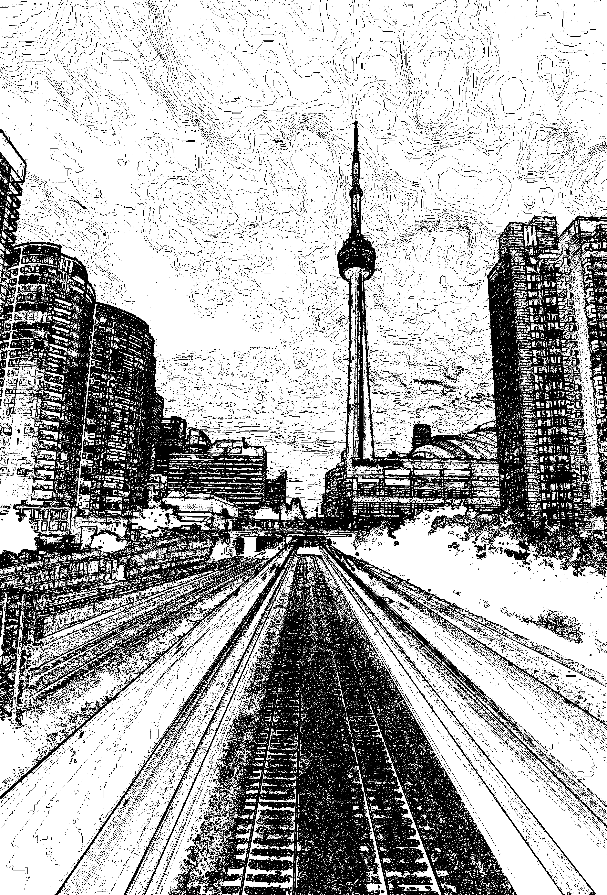

<table>
  <tr>
    <th>INPUT</th>
    <th>OUTPUT</th>
  </tr>
  <tr>
    <td></td>
    <td></td>
  </tr>
</table>


# Advanced Image Editing System

This tool lets you apply a sequence of image filters and adjustments based on a JSON configuration file.

## Prerequisites
- Java 17 (or newer) installed and `java`/`javac` on your PATH.
- No additional libraries required—everything uses core Java and AWT/Swing.

## Project Structure
```
AdvancedImageEditingSystem/
├── src/                     # Java source files
│   ├── image_editor/        # Core image processing classes
│   ├── input/              # JSON reader, config validation
│   ├── operations/         # Image operation implementations
│   ├── output/             # Writers (display, file)
│   ├── program/            # Program Interface and Factory
│   ├── utils/              # Utility classes (constants)
│   └── Shell.java          # Command-line interface
├── out/                    # Compiled `.class` files
├── lib/                    # External libraries 
├── edit-image.jar         # Runnable JAR after packaging
├── edit-image             # Shell wrapper script
├── edit-image.bat         # Windows batch wrapper
├── update-compile         # Helper script to compile & package
├── config.json            # a config example to run 
└── image.png              # an image to test 
```

## Compilation & Packaging

1. **Getting Started**
   
    To run the program, you need to make the `edit-image` launcher executable:

    ```bash
    chmod +x edit-image
    ```
    Then, use the appropriate command based on your operating system (see below).


2. **Run the program**

   ### On macOS / Linux
   You can run the program like this:
   ```bash
   ./edit-image --config path/to/config.json
   ```
   Or directly:
   ```bash
   java -jar edit-image.jar --config path/to/config.json
   ```

   ### On Windows
   With the batch file next to your JAR:
   ```bat
   edit-image.bat --config path\to\config.json
   ```
   Or directly:
   ```bat
   java -jar edit-image.jar --config path\to\config.json
   ```
   In case this dosen't work, follow step 3. 
   
3. **Recompile Program**

    If that doesn't work, try making the build script executable and recompiling the project:
    
    ### On macOS / Linux
    ```bash
    chmod +x update-compile
    ./update-compile
    ```
    ### On Windows
    ```bat
    update-compile.bat
    ```

    This will:
    - Compile all `src/` files into the `out/` directory
    - Package `edit-image.jar` with the proper manifest
    
    Now go back to step 2.

## JSON Configuration
Your config file must be valid JSON and have at least one of:
- `"output": "..."` to save to file
- `"display": true` to show a window

Top-level keys:
```json
{
   "input":   "<path to input image>",      // required
   "output":  "<path to save image>",      // optional
   "display": <true|false>,                // optional
   "operations": [                         // required 
      { ... },                             // see below
      ...
   ]
}
```

### Field details
- **`input`** (`String`) – Path to the source image (PNG)
- **`output`** (`String`) – Path where the edited image will be saved (e.g. `out.png`). If omitted, no file is written.
- **`display`** (`Boolean`) – `true` to open a window displaying the final image; `false` or omitted to skip display.
- **`operations`** (`Array`) – Sequence of filters/adjustments to apply in order.

### Supported operations
Each operation is a JSON object with a mandatory `"type"` field and type-specific parameters. All numeric values may be integers or floats. Order of operation determine the order of operations run.

## 🛠 Supported Operations & Constraints

| Type           | Parameters                        | Description                                               | Constraints                                              |
|----------------|-----------------------------------|-----------------------------------------------------------|----------------------------------------------------------|
| **brightness** | `value` (`double ≥ 0`)             | Scale RGB channels by this factor (0 = black, >1 = brighter) | Must be > 0 and ≤ **10,000**                             |
| **contrast**   | `value` (`double`, recommended ≥ 0) | Stretch around mid-gray: `(x-128)*value+128`              | Absolute value must be ≤ **10,000**                      |
| **saturation** | `value` (`double ≥ 0`)            | Multiply HSL "S" channel (0 = grayscale, >1 = vivid)      | Must be > 0 and ≤ **10,000**                             |
| **sharpen**    | `alpha` (`double ≥ 0`)            | Unsharp mask (radius=2) to enhance edges                  | Must be ≥ 0 and ≤ **10,000**                             |
| **box**        | `width`, `height` (`int ≥ 1`)     | Box-blur kernel size (e.g., 5×3)                          | Must each be ≥ 1 and ≤ **1,000**                         |
| **sobel**      | `threshold` (`double ≥ 0`)        | Edge detection; zero out gradients below threshold         | Must be ≥ 0 and ≤ **10,000**                             |

Violating any of these constraints will throw a `FormatException` with a detailed message.

#### Example
```json
{
   "input":   "image.png",
   "output":  "out.png",
   "display": true,
   "operations": [
      { "type": "brightness", "value": 0.8 },
      { "type": "box",        "width": 5, "height": 3 },
      { "type": "contrast",   "value": 1.2 },
      { "type": "saturation", "value": 1.5 },
      { "type": "sharpen",    "alpha": 0.7 },
      { "type": "sobel",      "threshold": 10.0 }
   ]
}
```

## Scripts
- **`./update-compile`**: Bash script to recompile and repackage JAR.
- **`edit-image`**: Shell wrapper that calls `java -jar edit-image.jar`.
- **`edit-image.bat`**: Windows batch wrapper for the JAR.

## Error Handling
- Invalid JSON configurations will result in clear error messages
- Missing input files will be reported with appropriate error messages
- Invalid operation parameters will be validated before processing
- The program will exit with non-zero status code on errors

---

Happy editing!

Author: Elad Firer

